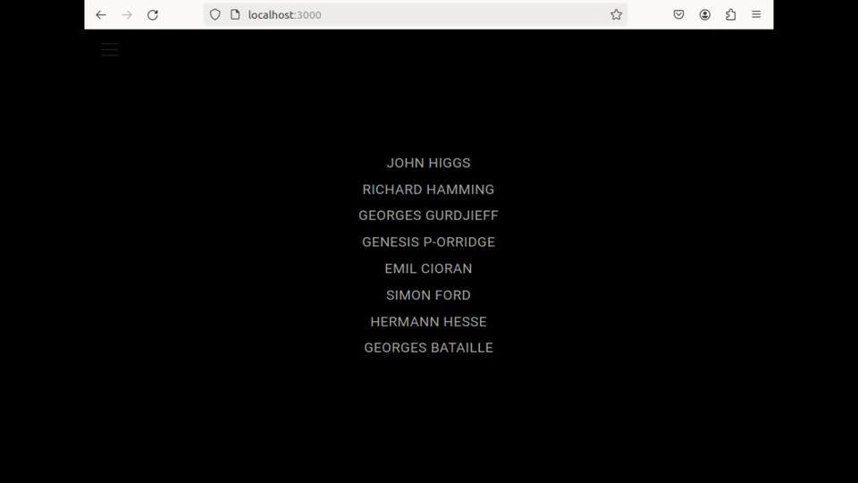
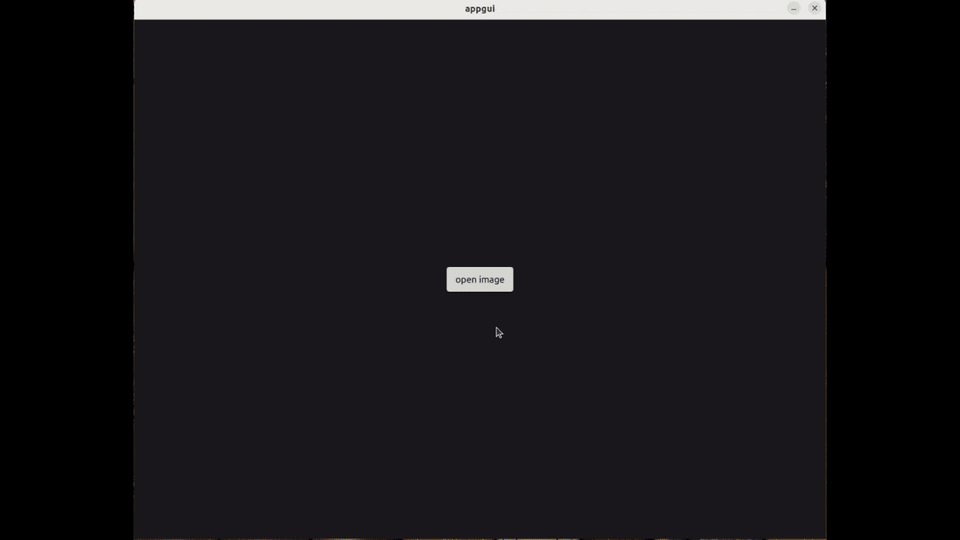
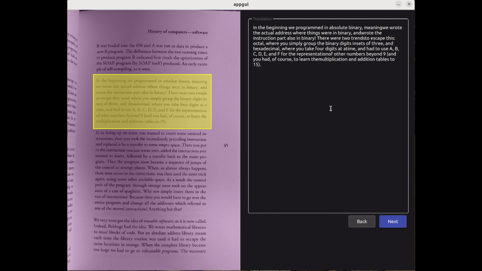
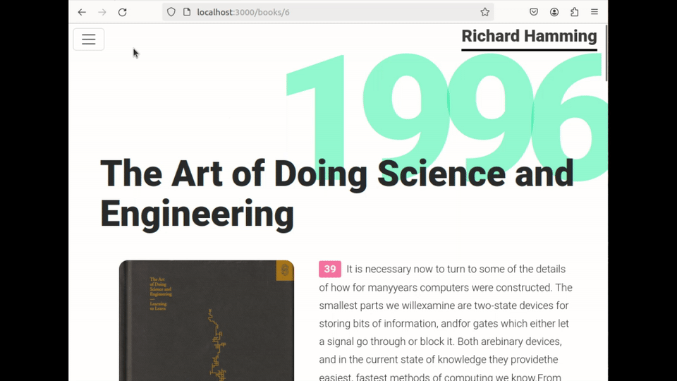
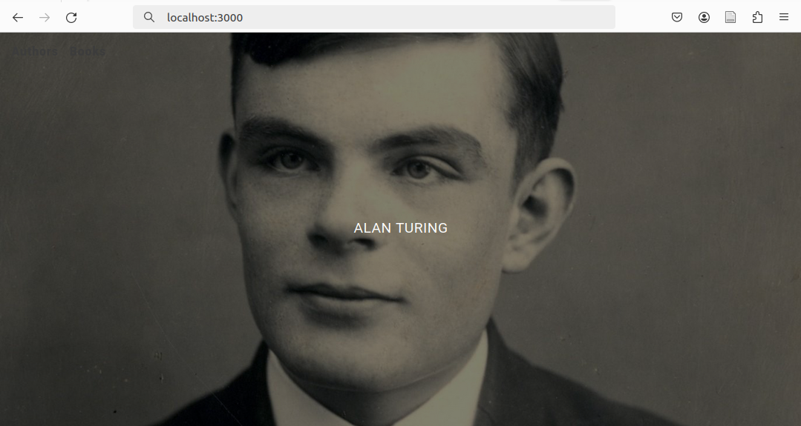
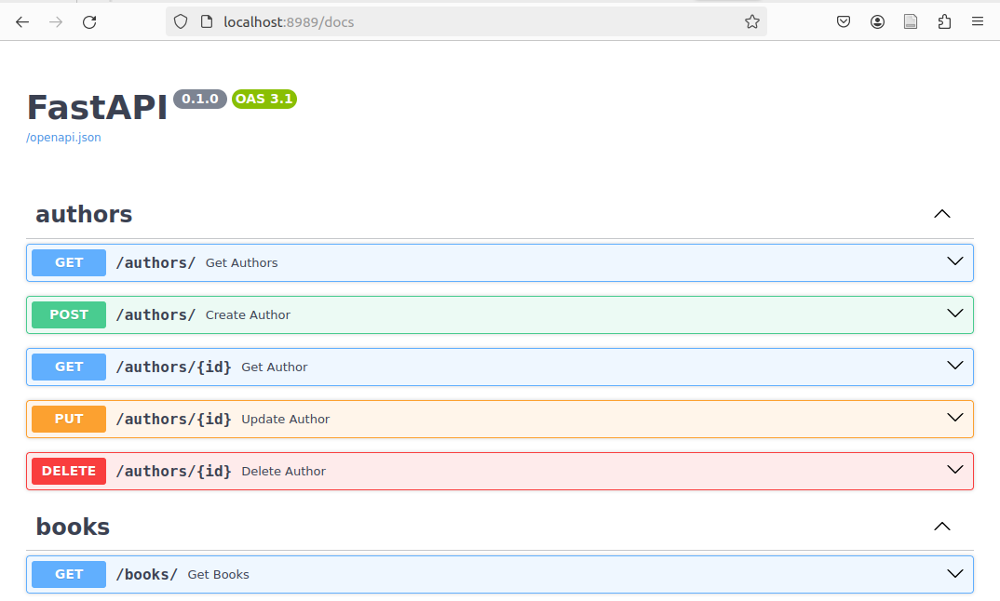

# OCR-book-dataset

Simple project made using [OpenCV](https://github.com/opencv/opencv) and [Tesseract](https://github.com/tesseract-ocr/tesseract) with [C++ / Qt framework](https://www.qt.io/) to read screenshots from book pages and extract text content to be fetch into a dataset. The aim was to automate the process of taking notes manually and to implement an interface where the user can select book extracts to be saved.

The project involves python [FastAPI](https://github.com/tiangolo/fastapi) web framework to provide an api and a simple frontend client built with [React](https://github.com/facebook/react) and [Nginx](https://nginx.org/en/) web server. Qt offers a GUI to process and translate image to text to generate new entries to the dataset.


## Content 

- [Demo](#Demo)
- [Dependencies](#Dependencies)
- [Installation](#Installation)
- [Technology-stack](#Technology-stack)


## Demo

### 1. Default Client 



### 2. OCR GUI while translating image selection to text



### 3. OCR GUI saving new book extract to database



### 4. Refreshing client to see effective change




## Dependencies

### API requirements

- [Docker](https://www.docker.com/) 26.0.1+
- [Docker compose](https://docs.docker.com/compose/) 2.26.1+

### GUI requirements

- [C++](https://gcc.gnu.org/) 11.3.0+ 
- [CMake](https://cmake.org/) 3.16+
- [Qt](https://www.qt.io/) 6.3+
- [Tesseract](https://tesseract-ocr.github.io/) 4.0+
- [OpenCV](https://opencv.org/) 4.0+


## Installation

This repository is splitted upon two main directories. The `api` folder containing all of our frontend and backend services, while the `ocr` folder gathers all files related to our `gui` :

```bash
.
├── api
│   ├── backend
│   ├── db
│   └── frontend
└── ocr
    └── gui

```

### Build and run the API

First we need build our backend and frontend services. To do so, a `docker-compose.yml` file is present inside the `api` directory. To automatically generate our build images and run the necessary containers  : 

```bash
cd api && docker compose up --build
```

Once our containers are running, we can access both our frontend and backend services.

#### Frontend (Default view)

Running at : http://localhost:3000



#### Backend (Interactive API docs)

Running at : http://localhost:8989/docs



FastAPI uses [Swagger UI](https://github.com/swagger-api/swagger-ui) to generate an interactive documentation to visualize and interact with the api and its relied dataset.

**Note**: By default, the current project is shipped with mysql database schema and minimal dataset using  mysql docker container.

### Build the OCR (GUI) 

**Note** : the `gui` part of the project has been developed on an `x86_64` cpu architecture using `Ubuntu 22.04` operating system. All the following steps will describe the process of building the project on that specific architecture and setup only.

#### OpenCV and Tesseract libraries installation

As our `gui` was build using OpenCV and Tesseract, we first need to install the dependencies following those instructions :

- [OpenCV installation on Linux](https://docs.opencv.org/4.x/d7/d9f/tutorial_linux_install.html)
- [Tesseract installation on Ubuntu](https://tesseract-ocr.github.io/tessdoc/Installation.html#ubuntu)

#### Qt Creator installation

The simplest way to build the project as configured, is to use [Qt Creator](https://www.qt.io/product/development-tools) to generate the final executable. Installing Qt Creator will automatically install all necessary dependencies to manage it.


## Technology Stack

### Backend

- [FastAPI](https://fastapi.tiangolo.com/) : Python Web framework to build APIs
- [SQLAlchemy](https://www.sqlalchemy.org/) : SQL toolkit and ORM (for database interactions)
- [Pydantic](https://docs.pydantic.dev/1.10/) : Data validation and settings management
- [Uvicorn](https://www.uvicorn.org/) : ASGI web server

### Frontend

- [React](https://react.dev/) : frontend Javascript Framework
- [React-Bootstrap](https://react-bootstrap.github.io/) : Bootstrap frontend components (*wip*)
- [Nginx](https://nginx.org/en/) : HTTP web server

### GUI

- [Qt](https://www.qt.io/) : Cross-Platform application development framework for desktop, embedded and mobile
- [QML](https://doc.qt.io/qt-6/qmlreference.html) : Multi-Paradigm Language for creating highly dynamic applications in Qt
- [QtQuick](https://doc.qt.io/qt-6/qtquick-index.html) : Standard library for writing QML applications
- [OpenCV](https://github.com/opencv/opencv) : Open Source Computer Vision Library
- [Tesseract](https://github.com/tesseract-ocr/tesseract) : Open Source OCR Engine

### Deployment

- [Docker](https://www.docker.com/) : open platform to build, ship, and run distributed applications
- [Docker compose](https://github.com/docker/compose/) : Define and run multi-container applications with Docker


## Releases

**Work In Progress...**


